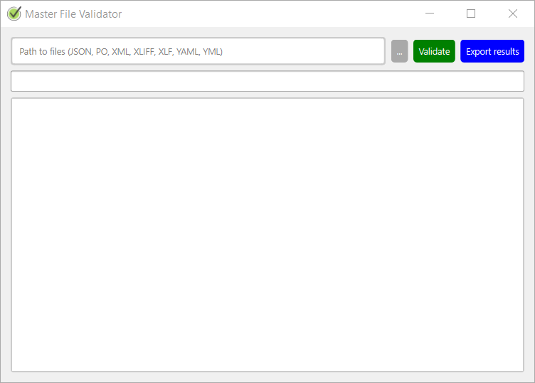
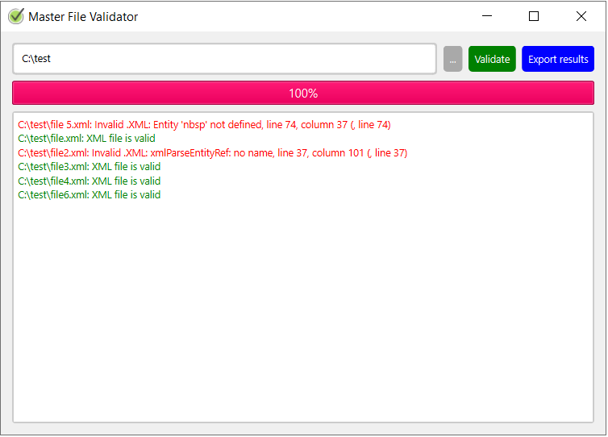

# Master File Validator

A simple file validation tool with a graphical user interface developed using PyQt6.

## Overview

The Master File Validator is a PyQt6-based tool that allows users to validate files with various formats, including JSON, XML, XLIFF, XLF, PO, YAML, and YML. The tool provides a user-friendly interface for selecting a directory, validating files within it, and exporting the validation results.

## Features

- Validates files with different formats.
- User-friendly graphical interface.
- Progress bar to track validation progress.
- Export validation results to a text file.

## Requirements
pip install followed by dependency name

- Python 3.x
- PyQt6
- lxml
- polib
- ruamel.yaml

## Usage

1. Clone the repository:

   ```bash
   git clone https://github.com/vicparramain/master_file_validator.git
   cd master_file_validator

## Binary available
https://github.com/vicparramain/master_file_validator/releases/download/1.0/Master_File_Validator_1.0.exe

## Screenshots




## License
This project is licensed under the GNU Affero General Public License v3.0. See the LICENSE file for details.

## Author
Víctor Parra
