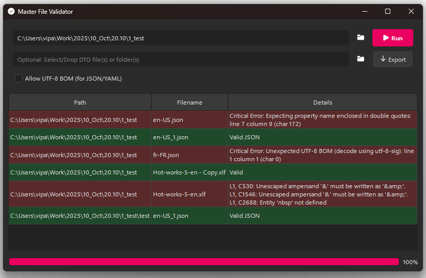
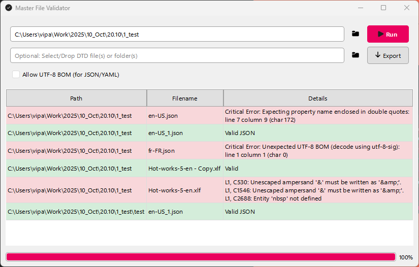

# Master File Validator

A modern, cross-platform file validation tool with a dynamic, theme-aware GUI built with **PySide6**.

This utility scans a directory and validates a wide range of common file formats, providing detailed error reporting and DTD validation for XML.

---




---

## 🧩 Features

- **Wide Format Support:** Validate JSON, XML, DITA, XLIFF, XLF, PO, YAML, and YML files.  
- **XML DTD Validation:** Validate XML-based files against one or more DTD files.  
- **Modern GUI:** Clean, professional interface built with PySide6.  
- **Theme Aware:** Automatically detects system light/dark mode and Windows accent colors for a native feel.  
- **Drag & Drop:** Supports dragging and dropping folders to scan and DTD files to load.  
- **Detailed Reporting:** Displays results in a sortable, 3-column table showing the file path, name, and validation details.  
- **HTML Export:** Export validation reports as a styled HTML file with color-coded rows for success or failure.  
- **BOM Support:** Optionally allows UTF-8 BOM (Byte Order Mark) in JSON and YAML files.  

---

## ⚙️ Requirements

- Python **3.8+**  
- **PySide6**  
- **lxml**  
- **polib**  
- **ruamel.yaml**  

---

## 🚀 Installation & Usage

1. Clone the repository:

   ```bash
   git clone https://github.com/vicparramain/master_file_validator.git
   cd master_file_validator
   python run.py

---

## Binary available
https://github.com/vicparramain/master_file_validator/releases/download/1.0/Master_File_Validator_2.0.exe

---


## License
This project is licensed under the GNU Affero General Public License v3.0. See the LICENSE file for details.

---

## Author
Víctor Parra
